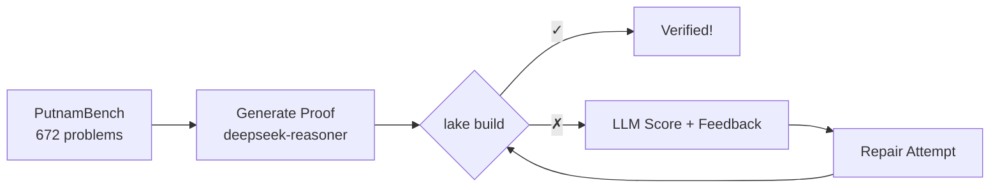

# Nomos-Lean

A Lean 4 formal verification agent for Olympiad mathematics. Generates machine-verifiable proofs and validates them with `lake build` for deterministic correctness.

## Benchmark Results

| Approach | Solved | Rate | Time |
|----------|--------|------|------|
| Baseline (single-shot) | 13/100 | 13% | 137 min |
| **Harness (with repair loop)** | **58/100** | **58%** | 225 min |

*Tested on first 100 PutnamBench problems using `deepseek-reasoner`.*

## Overview

Nomos-Lean replaces LLM-based scoring with formal verification:

| Aspect | Traditional | Nomos-Lean |
|--------|-------------|------------|
| **Verification** | LLM scoring | Lean 4 `lake build` |
| **Certainty** | Probabilistic | Deterministic (100%) |
| **Input** | Markdown problems | [PutnamBench](https://github.com/trishullab/PutnamBench) Lean 4 |
| **Output** | Natural language | Compilable `.lean` files |


## Workflow



1. **Generate**: LLM produces a complete Lean 4 proof
2. **Verify**: `lake build` checks type-correctness
3. **Repair**: If verification fails, LLM refines based on error feedback
4. **Repeat**: Until verified or max attempts reached

## Installation

### Prerequisites
- Python 3.11+
- [Lean 4 / elan](https://leanprover.github.io/lean4/doc/setup.html)

### Setup

```bash
# Clone with PutnamBench submodule
git clone --recursive https://github.com/your-repo/nomos-lean

# Install Python dependencies
pip install -r requirements.txt

# Configure API key
cp .env.example .env
# Edit .env with your DeepSeek API key

# Initialize Lean project (downloads Mathlib, takes 5-10 min)
cd lean_project && lake build
```

## Usage

```bash
# Single problem test
python lean_solve_agent.py PutnamBench/ --problems_limit=1

# Run specific problems
python lean_solve_agent.py PutnamBench/ --problems_filter="1962_a[1-3]"

# Full benchmark (recommended config: 16 LLM workers + 6 verify workers)
python lean_solve_agent.py PutnamBench/ \
    --problems_limit=100 \
    --max_concurrent=16 \
    --max_verify_concurrent=6 \
    --time_limit_hours=4.0
```

### Baseline (No Repair Loop)

For comparison or quick single-shot runs:

```bash
# Single-shot baseline (no repair, faster but lower solve rate)
python baseline_solve.py PutnamBench/ --problems_limit=100 --max_concurrent=4
```

### Options

| Flag | Default | Description |
|------|---------|-------------|
| `--problems_limit` | None | Max problems to attempt |
| `--problems_filter` | None | Regex filter for problem IDs |
| `--time_limit_hours` | `3.0` | Total time limit |
| `--max_concurrent` | `32` | Parallel LLM API workers |
| `--max_verify_concurrent` | `6` | Parallel Lean verifications (keep low to avoid CPU overload) |
| `--max_repair_attempts` | `3` | Repair loop depth |
| `--verification_timeout` | `60` | Seconds per verification |
| `--model` | `deepseek-reasoner` | LLM for proof generation |
| `--base_url` | DeepSeek API | OpenAI-compatible endpoint |

> **Tip**: Keep `max_verify_concurrent` at 4-8 to prevent Lean compilation timeouts. LLM workers can be higher (16-32) since API calls are I/O-bound.

## Failure Patterns

Analysis of 42 unsolved problems from our 100-problem benchmark:

| Pattern | Count | Example | Notes |
|---------|-------|---------|-------|
| **sorry placeholder** | ~40% | `putnam_1962_b6` | Model understands approach but can't complete final step |
| **Truncated code** (`...`) | ~25% | `putnam_1966_b4` | Extraction failed to get complete proof |
| **Missing Mathlib lemma** | ~20% | `putnam_1970_b3` | Requires `Bounded` → needs Mathlib API knowledge |
| **Type mismatch** | ~15% | `putnam_1964_a1` | Valid approach but types don't unify |

**Key insight**: Most failures are mathematical (model can't complete the proof) rather than syntactic. The extraction and repair systems are working; the LLM simply lacks the theorem-proving depth for harder problems.

## Project Structure

```
nomos-lean/
├── lean_solve_agent.py   # Main agent (generate → verify → repair)
├── lean_verifier.py      # Subprocess wrapper for lake build
├── putnam_bench.py       # PutnamBench dataset loader
├── prompts/
│   ├── lean_solve.md     # Proof generation prompt
│   ├── lean_repair.md    # Error-based repair prompt
│   └── lean_score.md     # Partial proof scoring
├── lean_project/         # Lake project with Mathlib
│   ├── lakefile.toml
│   └── Proofs/           # Generated proof files
└── PutnamBench/          # Submodule: 672 competition problems
```

## Requirements

- **API**: DeepSeek API key (or any OpenAI-compatible endpoint)
- **Lean**: elan-managed toolchain (`leanprover/lean4:v4.x`)
- **Disk**: ~5GB for Mathlib cache

## License

MIT
